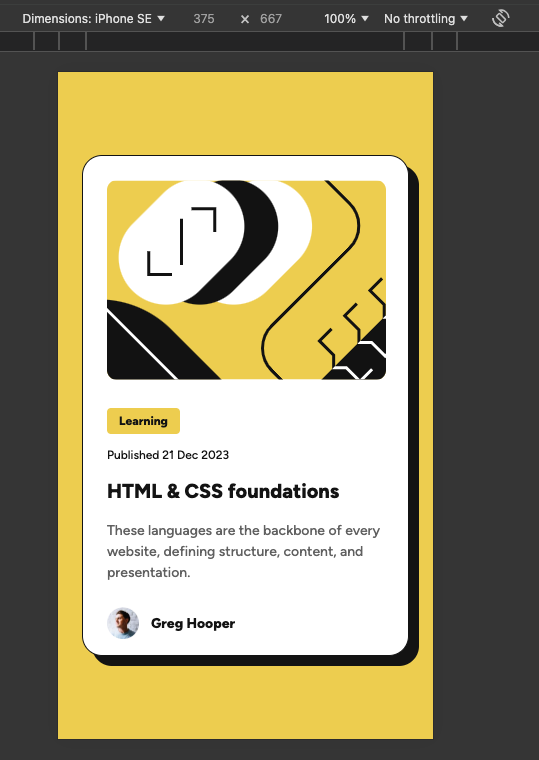
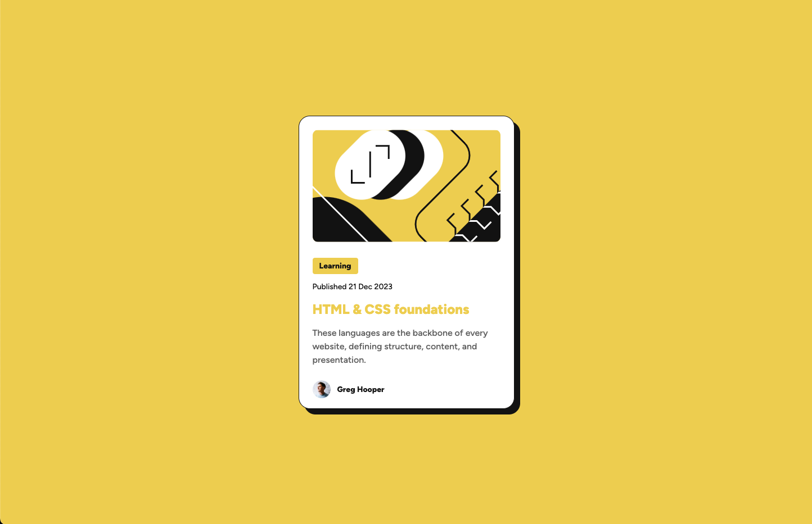

# Frontend Mentor - Blog preview card solution

This is a solution to the [Blog preview card challenge on Frontend Mentor](https://www.frontendmentor.io/challenges/blog-preview-card-ckPaj01IcS). Frontend Mentor challenges help you improve your coding skills by building realistic projects. 

## Table of contents

- [Frontend Mentor - Blog preview card solution](#frontend-mentor---blog-preview-card-solution)
  - [Table of contents](#table-of-contents)
  - [Overview](#overview)
    - [Screenshot](#screenshot)
    - [Links](#links)
  - [My process](#my-process)
    - [Built with](#built-with)
    - [What I learned](#what-i-learned)
    - [Useful resources](#useful-resources)
  - [Author](#author)

## Overview

### Screenshot

### Links

- Solution URL: [GitHub](https://github.com/AntonioALV92/blog-preview-card)
- Live Site URL: [GitHub Pages](https://antonioalv92.github.io/blog-preview-card/)

## My process

### Built with

- Semantic HTML5 markup
- CSS custom properties
- CSS BEM methodology
- Flexbox
- Mobile-first workflow
- [Figtree] - Variable Font
- Git Conventional Commits

### What I learned

I learned how to implement a variable font and how to use clamp function on CSS for responsive fonts. Also I remembered how it works the box-sizing property.

### Useful resources

- [CSS clamp](https://developer.mozilla.org/en-US/docs/Web/CSS/clamp) - This helped me for understand how to works function clamp.
- [CSS box-sizing](https://developer.mozilla.org/en-US/docs/Web/CSS/box-sizing) - This helped me for remember how to use the box-sizing on CSS.
- [Variable fonts guide](https://developer.mozilla.org/en-US/docs/Web/CSS/CSS_fonts/Variable_fonts_guide) - This helped me for understand how to works variable fonts.

## Author

- LinkedIn - [Antonio López](https://www.linkedin.com/in/antoniolv/)
- Frontend Mentor - [@AntonioALV92](https://www.frontendmentor.io/profile/AntonioALV92)